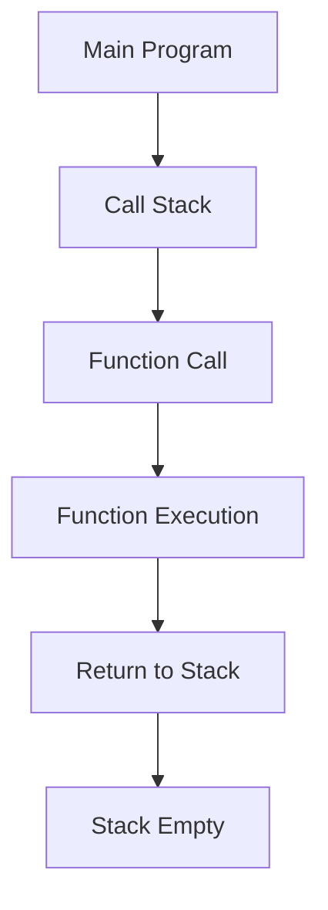
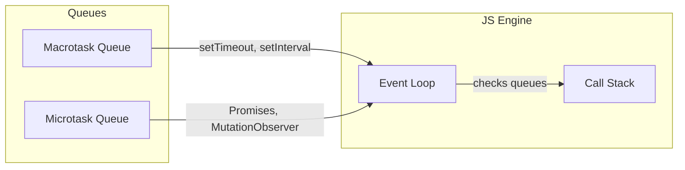

# JavaScript Async & Event Loop Explained


## How the Call Stack Works



- The call stack is where JS keeps track of function calls.
- When a function is called, it's pushed onto the stack. When it returns, it's popped off.

## Sync vs Async

- **Synchronous**: Code runs line by line, blocking the next line until the current one finishes.
- **Asynchronous**: Code (like setTimeout, fetch, promises) is handled outside the stack, allowing the stack to keep running.

## Event Loop, Microtask & Macrotask Queues



- **Macrotask Queue**: setTimeout, setInterval, I/O, UI rendering
- **Microtask Queue**: Promises, MutationObserver
- The event loop checks the stack, then microtasks, then macrotasks.

## Example: Synchronous vs Asynchronous

```js
console.log("A");
setTimeout(() => console.log("B"), 0);
Promise.resolve().then(() => console.log("C"));
console.log("D");
// Output: A D C B
```

- 'A' and 'D' are synchronous.
- Promise (microtask) runs before setTimeout (macrotask).

## Example: Microtask vs Macrotask

```js
setTimeout(() => console.log("timeout"), 0);
Promise.resolve().then(() => console.log("promise"));
// Output: promise timeout
```

---

- Microtasks always run before the next macrotask.
