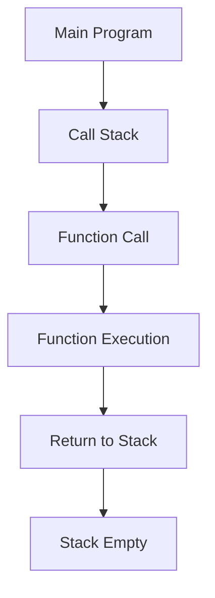
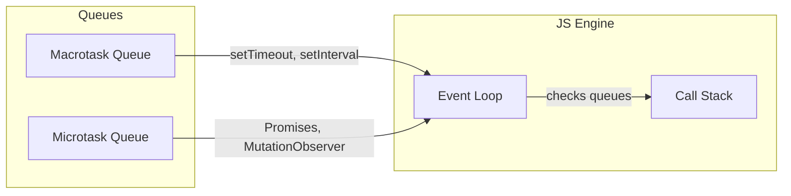
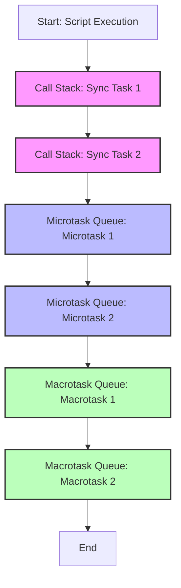

# JavaScript Async & Event Loop Explained

## How the Call Stack Works



- The call stack is where JS keeps track of function calls.
- When a function is called, it's pushed onto the stack. When it returns, it's popped off.

## Sync vs Async

- **Synchronous**: Code runs line by line, blocking the next line until the current one finishes.
- **Asynchronous**: Code (like setTimeout, fetch, promises) is handled outside the stack, allowing the stack to keep running.

## Event Loop, Microtask & Macrotask Queues



- **Macrotask Queue**: setTimeout, setInterval, I/O, UI rendering
- **Microtask Queue**: Promises, MutationObserver
- The event loop checks the stack, then microtasks, then macrotasks.

## Example: Synchronous vs Asynchronous

```js
console.log("A");
setTimeout(() => console.log("B"), 0);
Promise.resolve().then(() => console.log("C"));
console.log("D");
// Output: A D C B
```

- 'A' and 'D' are synchronous.
- Promise (microtask) runs before setTimeout (macrotask).

## Example: Microtask vs Macrotask

```js
setTimeout(() => console.log("timeout"), 0);
Promise.resolve().then(() => console.log("promise"));
// Output: promise timeout
```

---

- Microtasks always run before the next macrotask.

---

## Order of Execution: Sync, Microtask, Macrotask

Suppose you have a mix of synchronous code, microtasks (like Promises), and macrotasks (like setTimeout). The order of execution is:

1. **Synchronous tasks** (run immediately, fill the call stack)
2. **Microtasks** (run after the current script, before any rendering or macrotask)
3. **Macrotasks** (run after microtasks, e.g., setTimeout, setInterval)

**Priority:**

- Microtasks have higher priority than macrotasks. All microtasks are executed before the next macrotask.

### Example Order

```js
console.log("sync 1");
Promise.resolve().then(() => console.log("microtask 1"));
setTimeout(() => console.log("macrotask 1"), 0);
console.log("sync 2");
Promise.resolve().then(() => console.log("microtask 2"));
setTimeout(() => console.log("macrotask 2"), 0);
// Output: sync 1, sync 2, microtask 1, microtask 2, macrotask 1, macrotask 2
```

### Mermaid Diagram: Execution Flow



- **Pink**: Synchronous tasks (call stack)
- **Blue**: Microtasks (Promise callbacks, MutationObserver)
- **Green**: Macrotasks (setTimeout, setInterval)

**Summary:**

- All synchronous code runs first.
- Then, all microtasks are executed in order.
- Only after the microtask queue is empty, the first macrotask is executed.
- This cycle repeats for each new macrotask.
