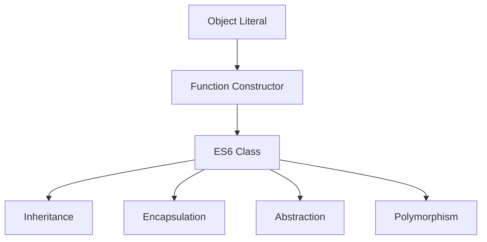
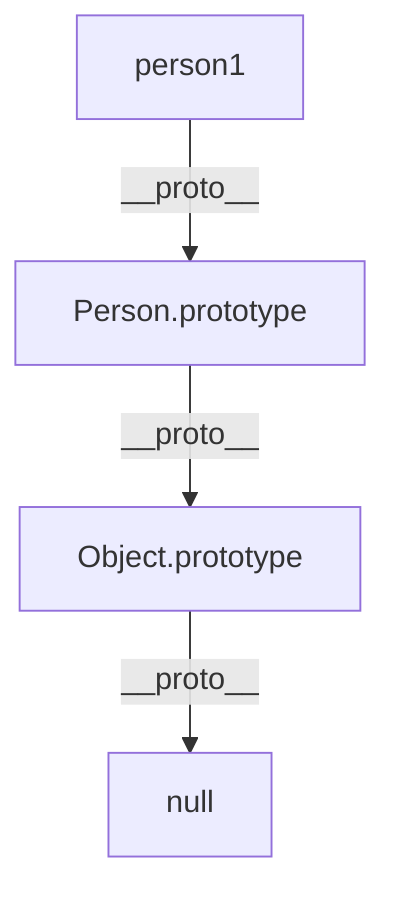
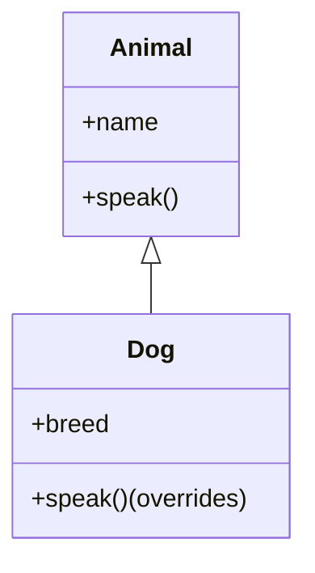
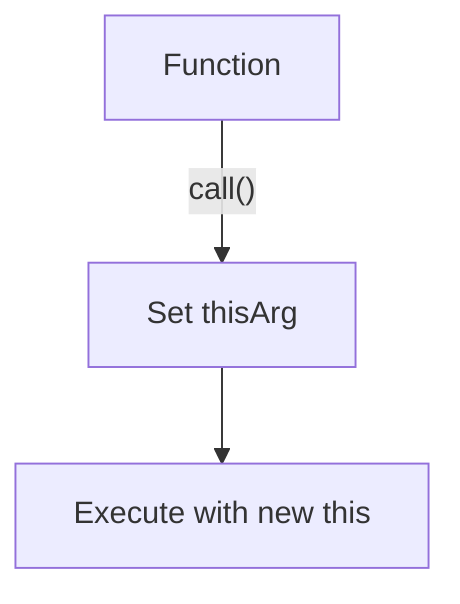
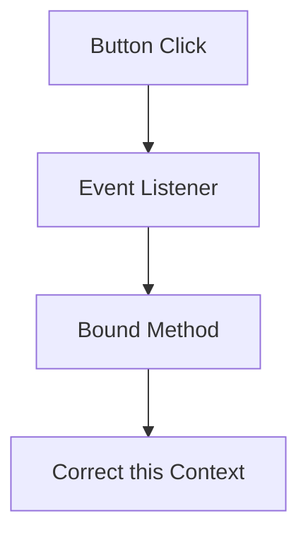
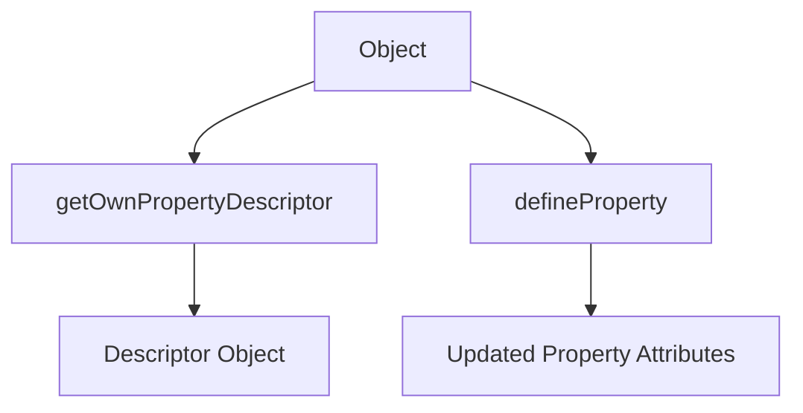

# Day 8: JavaScript OOP, Prototypes, `this`, and Property Descriptors

This folder contains JavaScript practice projects focused on Object-Oriented Programming (OOP), prototypes, the `this` keyword, method binding, and property descriptors.

---

## 🏛️ Object-Oriented Programming in JavaScript

JavaScript supports OOP through objects, function constructors, and ES6 classes. This day explores the evolution from manual object creation to full OOP with classes, and the underlying prototype system.

---

## 1. [`OOPs.js`](./OOPs.js)

### Manual Objects, Function Constructors, and ES6 Classes

- **Manual object literals**: Simple but not scalable; each object has its own methods (memory waste).
- **Function constructors**: More scalable, but methods are still duplicated per instance.
- **ES6 Classes**: Introduce OOP pillars—encapsulation, abstraction, inheritance, and polymorphism.

#### Mermaid: OOP Evolution



- **Encapsulation**: Bundles data and methods.
- **Abstraction**: Hides internal details (e.g., private fields).
- **Inheritance**: Classes can extend others.
- **Polymorphism**: Methods can be overridden in subclasses.

#### Example: Class Inheritance

```js
class User {
  constructor(name, age) {
    this.name = name;
    this.age = age;
  }
  greet() {
    console.log(`Hello, my name is ${this.name}`);
  }
}
class Student extends User {
  constructor(name, age, rollno) {
    super(name, age);
    this.rollno = rollno;
  }
  greet() {
    console.log(`Hi, I'm ${this.name} and my roll number is ${this.rollno}`);
  }
}
```

---

## 2. [`Prototye_in_js.js`](./Prototye_in_js.js)

### Prototypes and the Prototype Chain

- Every object has a hidden `[[Prototype]]` (seen as `__proto__` in browsers).
- Prototypes enable method sharing and inheritance.
- Methods on the prototype are shared by all instances (memory efficient).
- You can extend built-in types (e.g., add methods to `Array.prototype`).

#### Mermaid: Prototype Chain



#### Example: Extending Array

```js
Array.prototype.first = function () {
  return this[0];
};
const arr = [10, 20, 30];
console.log(arr.first()); // 10
```

- **ES6 classes** are syntactic sugar over prototypes; class methods are placed on the prototype.

---

## 3. [`Class_and_objects.js`](./Class_and_objects.js)

### Four Pillars of OOP in Detail

- **Encapsulation**: Data and methods together; hide internal state.
- **Abstraction**: Hide complexity, expose only essentials (private fields with `#`).
- **Inheritance**: Classes extend others, reuse code.
- **Polymorphism**: Subclasses override parent methods.

#### Mermaid: Class Inheritance



- **Static methods**: Belong to the class, not instances.
- **Access modifiers**: `public` (default), `#private`, `_protected` (by convention).
- **super**: Calls parent constructor/methods.

#### Example: Static Method

```js
class MathUtil {
  static add(a, b) {
    return a + b;
  }
}
console.log(MathUtil.add(5, 7)); // 12
```

---

## 4. [`call_and_this.js`](./call_and_this.js)

### The `call()` Method and Controlling `this`

- `call()` lets you invoke a function with a specific `this` value.
- Useful for method borrowing and fixing `this` in callbacks.

#### Example: Method Borrowing

```js
const car = {
  brand: "Toyota",
  showBrand: function () {
    console.log(this.brand);
  },
};
const bike = { brand: "Yamaha" };
car.showBrand.call(bike); // Yamaha
```

#### Mermaid: `call()` Flow



- When passing methods as callbacks, `this` can be lost; use `call()` to fix it.

---

## 5. [`bind.htm`](./bind.htm)

### The `bind()` Method and Event Handlers

- `bind()` creates a new function with `this` permanently set.
- Essential for event handlers in classes (e.g., React components).

#### Example: Binding in Event Handler

```js
class App {
  constructor() {
    this.name = "my app";
    document
      .querySelector("#button")
      .addEventListener("click", this.handleClick.bind(this));
  }
  handleClick() {
    console.log(this.name);
  }
}
```

#### Mermaid: Event Handler Binding



- Without `bind`, `this` inside the handler would be `undefined` or the DOM element.

---

## 6. [`Maths_pi.js`](./Maths_pi.js)

### Property Descriptors and Immutability

- Use `Object.getOwnPropertyDescriptor` to inspect property attributes (writable, enumerable, configurable).
- Use `Object.defineProperty` to change property attributes (e.g., make a property read-only).

#### Example: Making a Property Read-Only

```js
const customer = { name: "kush", password: 123445 };
Object.defineProperty(customer, "password", { writable: false });
```

#### Mermaid: Property Descriptor Workflow



- Useful for securing sensitive data or enforcing immutability.

---

## 7. [`getter_setter.js`](./getter_setter.js)

### Getters and Setters in JavaScript

- Getters and setters allow you to define special methods for reading and writing object properties.
- They provide a way to control access, validation, or computed values for properties.

#### Example: Object Literal Getter/Setter

```js
const person = {
  firstName: "Alice",
  lastName: "Smith",
  get fullName() {
    return `${this.firstName} ${this.lastName}`;
  },
  set fullName(name) {
    const parts = name.split(" ");
    this.firstName = parts[0];
    this.lastName = parts[1] || "";
  },
};
console.log(person.fullName); // Alice Smith
person.fullName = "Bob Johnson";
console.log(person.firstName); // Bob
console.log(person.lastName); // Johnson
```

#### Example: Class Getter/Setter

```js
class Rectangle {
  constructor(width, height) {
    this.width = width;
    this.height = height;
  }
  get area() {
    return this.width * this.height;
  }
  set area(value) {
    this.width = value / this.height;
  }
}
const rect = new Rectangle(10, 5);
console.log(rect.area); // 50
rect.area = 100;
console.log(rect.width); // 20
console.log(rect.height); // 5
```

#### Example: Validation with Setter

```js
class User {
  constructor() {
    this._age = 0;
  }
  get age() {
    return this._age;
  }
  set age(value) {
    if (value < 0) {
      console.log("Age cannot be negative!");
      return;
    }
    this._age = value;
  }
}
const user = new User();
user.age = 25;
console.log(user.age); // 25
user.age = -5; // Age cannot be negative!
console.log(user.age); // 25
```

- Use a different variable (like `_age`) for storage to avoid recursion errors.
- Getters and setters are useful for computed properties, validation, and encapsulation.

---

## 8. [`closures.htm`](./closures.htm)

### Lexical Scoping and Closures in JavaScript

- **Lexical scoping**: Variable accessibility is determined by code structure (where functions are written/nested).
- **Closure**: An inner function remembers variables from its outer (lexical) scope, even after the outer function has finished executing.

#### Example: Lexical Scope

```js
function outer() {
  let outerVar = "I am from outer!";
  function inner() {
    console.log(outerVar); // Can access outerVar due to lexical scope
  }
  inner();
}
outer(); // Output: I am from outer!
```

#### Example: Closure

```js
function makeCounter() {
  let count = 0;
  return function () {
    count++;
    return count;
  };
}
const counter = makeCounter();
console.log(counter()); // 1
console.log(counter()); // 2
console.log(counter()); // 3
```

#### Example: Data Privacy with Closures

```js
function secretHolder(secret) {
  return {
    getSecret: function () {
      return secret;
    },
    setSecret: function (newSecret) {
      secret = newSecret;
    },
  };
}
const holder = secretHolder("JS Rocks!");
console.log(holder.getSecret()); // JS Rocks!
holder.setSecret("Closures are cool!");
console.log(holder.getSecret()); // Closures are cool!
```

#### Common Closure Pitfall: Loop with var

```js
var funcs = [];
for (var i = 0; i < 3; i++) {
  funcs.push(function () {
    console.log(i);
  });
}
funcs[0](); // 3
funcs[1](); // 3
funcs[2](); // 3
// All log 3, not 0, 1, 2! Because 'i' is shared (function-scoped)
```

#### Solution: Use let (block-scoped)

```js
var funcs = [];
for (let i = 0; i < 3; i++) {
  funcs.push(function () {
    console.log(i);
  });
}
funcs[0](); // 0
funcs[1](); // 1
funcs[2](); // 2
```

- Closures are useful for data privacy, factory functions, and callbacks/event handlers.
- Lexical scoping and closures are foundational for understanding advanced JavaScript behavior.

---

## How to Run These Projects

1. Open the relevant `.js` file in your code editor or browser console.
2. For `bind.htm` and `closures.htm`, open in your web browser and interact with the page or check the console.
3. Read code comments and outputs for learning.

---

This folder is part of the Day 8 JavaScript practice series.
